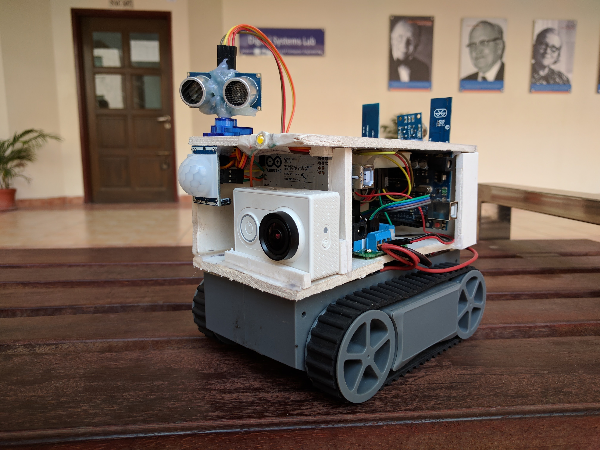
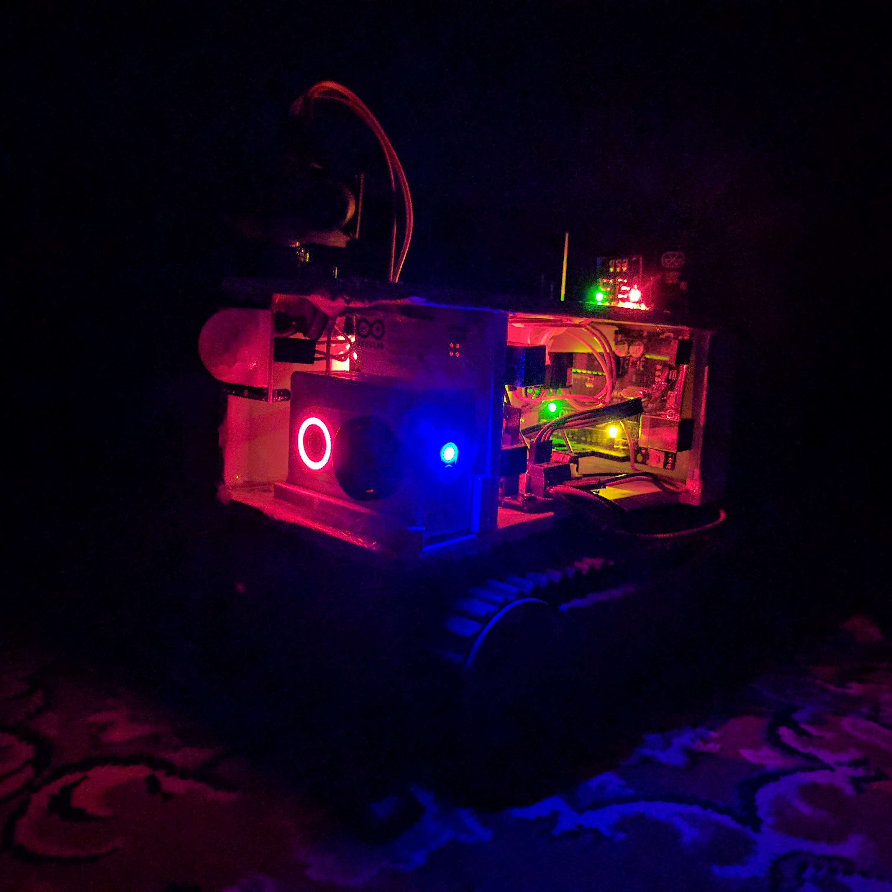
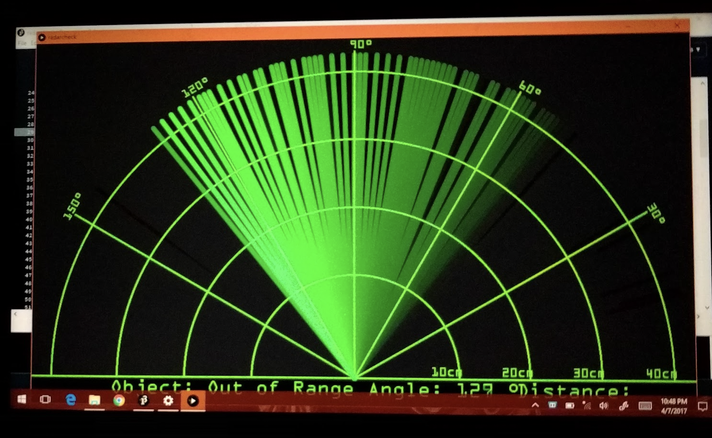
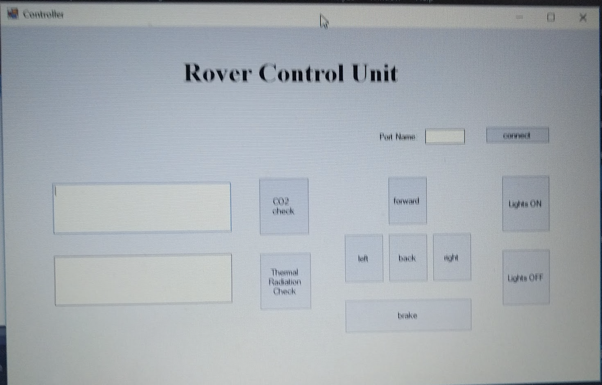

# Trapped Human Detector
**Team Lead**: [Al-Amin Hossain](mailto:alamin.hossain.cs@gmail.com)

**Team Members**: Tasfia Mehraj & MH Mahir

## Overview
Trapped Human Detector is type of rescue bot where we have used rover chassis along with track chain so that it would not have any difficulties in moving through any rumble. The prototype of the rescue bot will be small and portable so that it can be easily carried anywhere and can enter through any small gaps or spaces of rumbles of buildings.

## Equipments
Arduino Uno, Bluetooth, Sonar Sensor, Passive Infrared Sensor (PIR), GAS Sensor, Camera, Servo Motor, Rover Chesis

Final Prototype of Trapped Human Detector

Night View of the Prototype

Radar Screen

Control Unit Using C#